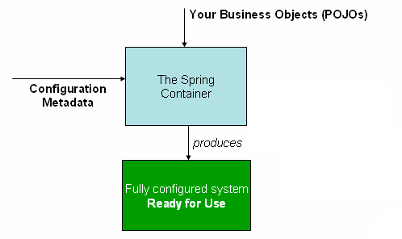

IoC is also known as dependency injection (DI). It is a process whereby objects define their dependencies (that is, the other objects they work with) 
only through constructor arguments, arguments to a factory method, or properties that are set on the object instance after it is constructed or returned 
from a factory method. The container then injects those dependencies when it creates the bean

Spring IoC container and is responsible for instantiating, configuring, and assembling the beans. The container gets its instructions on what objects 
to instantiate, configure, and assemble by reading configuration metadata. The configuration metadata is represented in XML, Java annotations,
or Java code. It lets you express the objects that compose your application and the rich interdependencies between those objects.

The following diagram shows a high-level view of how Spring works. Your application classes are combined with configuration metadata so that,
after the ApplicationContext is created and initialized, you have a fully configured and executable system or application.

As the preceding diagram shows, the Spring IoC container consumes a form of configuration metadata. This configuration metadata 
represents how you, as an application developer, tell the Spring container to instantiate, configure, and assemble the objects in your application.

## **Configuration Metadata:**